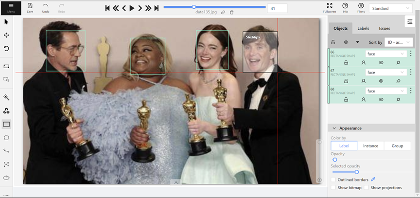
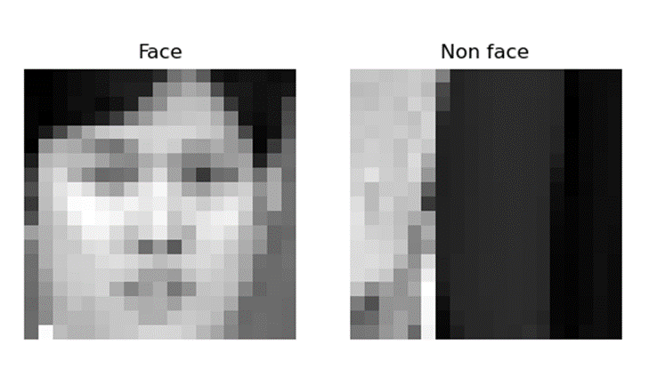

# AI Capstone project#1

# **1. 簡介**

這次Project的目標是**人臉偵測**，希望能訓練模型識別出圖像中的圖像是否為人臉，並以方框標示出人臉範圍，而Viola-Jones algorithm、yolov8、K-means Clustering是這次會用來訓練的算法與模型。

# **2. Dataset**

## **2.1 資料取得方式**

資料集的取得方式有兩種，其一是從**Pinterest**上以關鍵字「Group」去下載圖片，但由於此管道下載之照片多為西方人，且多為攝影棚內拍攝的靜態照片，為擴增資料及豐富程度，加上第二種是從**國內外網路新聞媒體平台**上，以爬蟲方式下載政治、國際與體育新聞報導中的圖片，透過此方法得到許多不同國家及不同活動狀態下的人臉資料，增加了資料及集的豐富度。

## **2.2 資料前處理**

完成蒐集圖片後，第二步則是標註人臉，這裡採用cvat.ai網頁工具來標註，而標註完成後匯出**人臉位置資訊**於txt檔，資訊包含正規化後的x與y中心座標，及臉部寬度與高度。

txt 檔案格式 :
<Object_class = 0> <x_center> <y_center> <width> <height>

另外若是訓練Viola-Jones algorithm與K-means Clustering時，資料會需要先將圖片轉為**灰階圖片**，及裁切下人臉圖像，並且須完成**非人臉**資料集，這部分則會由原先人臉的**位置範圍隨機偏移**，使得偏移後新的範圍與原先範圍重疊率介於[0.1, 0.3]，並一樣轉為灰階並裁切圖片完成資料集。

## **2.3 資料數量**

此資料集原始共有183張照片，由此之中裁切出242張人臉圖像及隨機偏移裁切後之242張非人臉圖像，**共484張標註資料**。下圖即為裁切下的其中兩筆資料 :

# **3. 演算法**

## **3.1 Supervise learning**

### **3.1.1 Viola-Jones algorithm**

**簡介:**

Viola-Jones 演算法主要是利用內部Adaboost演算法來訓練一系列簡單的分類器，並組合成一個強分類器。過程包含從訓練集選擇一些Haar Features，對每個特徵找一個錯誤率最小的閾值作為最佳分類函數，將錯誤率最低的特徵作為弱分類器，並為每個弱分類器分配權重。不段重複以上動作直到達到預設弱分類器數量，最後再將所有弱分類器組合成一個強分類器。

**結果分析:**

這裡以70%資料作為Training Data，下表為**Confusion Matrix**所計算評估指標結果，可以看到Training與Testing Data的Accuracy都接近8成，看起來沒有Overfitting的問題。另外FN rate十分的低，顯示出正樣本(人臉物件)的檢測表現良好，漏檢率很低，可以正確地辨別。然而，FP rate這裡偏高，表示誤檢率較高，區分表現有待加強。

|  | Training | Testing |
| --- | --- | --- |
| False Positive Rate | 32.54% | 42.46% |
| False Negative Rate | 0.59% | 0% |
| Accuracy | 83.43% | 78.76% |

### **3.1.2 yolov8 algorithm**

**簡介:**

YOLOv8是YOLO (You Only Look Once)目標檢測系列的最新版本，可以用在圖片中快速地辨別物件，這次是使用yolov8n.pt的預訓練模型再逐步調整優化參數。訓練的方式除了調整epoch, batch, learning rate之外，也使用訓練後輸出的.pt檔逐步訓練優化。

**結果分析:**

這部分隨機以72%資料作為Training data，14%為validation data，14%作為Testing data。根據下表**Confusion Matrix**所計算評估指標結果，可以發現FP rate都較高，根據輸出標籤結果，推論是因為背景人群較多的圖片自己在標註時並沒有將後方每個人臉都標註起來，而模型仍偵測為人臉，因此FP rate看起來較高。如左圖為人工標籤資料，並無將背後人物一一標籤，而右圖在模型驗證時卻識別出人臉，由於這種情況應當不計於偵測錯誤，因此算是人為標註的不良所造成。

|  | Training | Testing |
| --- | --- | --- |
| False Possitive Rate | 10% | 18.4% |
| False Negative Rate | 2.5% | 0% |
| Accuracy | 87.5% | 81.6% |

而訓練完模型後，也輸入照片進行人臉檢測，結果如下圖，前幾張圖接100%偵測到人臉，不過人數最多的那張辨識效果較差，只有44%人臉被偵測出來。

### **3.2 Unsupervised learning**

**簡介:**

非監督式學習的部分首先利用**HOG**來提取圖像特徵，再使用**K-means Clustering**來作人臉與非人臉的分群，演算法的方式是先隨機給K個群心，如此例為兩群心，接著對每筆資料計算隊群心的歐式距離，將資料分配給較近的群心，再用資料更新一次新的群心，部段重複至收斂。並使用**K-Fold Cross Validation**每次選取不同訓練及來訓練K-means，反覆迭代後更全面性地評估模型性能，而這裡主要以Adjusted Rand Index, Mutual Information, Homogeneity, Completeness, V-measure五項指標做為評估。

**結果分析:**

使用K-Fold Cross Validation設定K=10，根據Adjusted Rand Index, Mutual Information, Homogeneity, Completeness, V-measure五項指標來看整體結果在分類上與真實類別的一致性與相關性高，誤差偏低顯示模型具有穩定性。

根據下表**Confusion Matrix**所計算評估指標結果，整體分類準確率高，FP rate和FN rate都很低，表現出整體分類上正確率高。

|  | Clustering |
| --- | --- |
| False Possitive Rate | 0.0% |
| False Negative Rate | 5.1% |
| Accuracy | 97.1% |

模型訓練後也輸入相同照片進行人臉檢測，結果顯示全部都分類預測正確。

# **4. 實驗與分析**

針對Viola-Jones algorithm實驗了迭代數T對於結果的影響，首先，FP rate整體比FN rate高的部分前面有提及，原因為部分圖片背景有許多較小的人臉於標註時未標註，但仍被偵測為人臉，因此誤認為是偵測錯誤。接著以趨勢來看，隨著迭代次數增加，模型學習樣本的特徵表現較好，將非人臉誤判為人臉的FP rate降低，同時保持了較低的FN rate，使整體判別準確率都偏高。不過趨勢上也能看出此模型性能在第六次迭代後趨於平緩，甚至偶有反向的情形發生，可能接近了algorithm的上限。

接著是K-means Clustering的部分，將K-Fold Cross Validation的K值為5及10做比較。首先在橫條圖顯示出K值由5改為10時，五者指標分數微幅提高。而在箱型圖顯示出Mutual Information的得分仍然最低，不過約從0.55提高至0.6；其餘指標約從0.8-0.85提高至0.85-0.9。值得注意的是在K=10時，每個指標都有一至多個明顯的異常值，可能是某一折的結果影響了整體得分。最後，散佈圖的分佈和結果在兩個圖中幾乎完全相同。這顯示出改變K的數值並沒有顯著影響K-means的結果。

# **5. 討論**

## **5.1 實驗**

關於實驗我原本會期待當迭帶次數越多或K-Fold折數越多時，效果應該要有所上升，不過實驗出來的結果看來即使大趨勢是上升，仍可能因為資料集性質、參數演變或演算法而有反向的變化，或是出現原本沒有的離群值，甚至是達到演算法參數的限制。

## **5.2 模型表現影響**

根據這次研究與操作三種模型的經驗，一開始都是先研究各個模型適合什麼樣的資料型態，即需要做**不一樣的資料前處理**。這次使用三個模型，即使資料集相同，也做了不一樣的前處理。Viola-Jones採用灰階矩陣並統一圖片資料像素、yolov8使用正規化過的座標位置、K-means Clustering先採用灰階矩陣，再用HOG來提取圖像特徵。我認為這是改變模型表現其中一個很重要的部分，就如我在訓練Unsupervised learning時，原先沒有用HOG時的五項評估指標皆為0.8%以下，後來採用HOG先提取特徵後，Clustering的評估指標表現提升至超過80%，幾乎快100倍的差別。另外，**參數調整**也是影響模型表現的因素，不論是epoch、batch、learning rate這些直接影響模型運作的因素，或是準備資料集時設定的參數，如非人臉資料集準備時，設定與人臉資料集的重疊比例，這些都有機會影響的模型表現，也是需要好好找出好參數的部分。

## **5.3 未來發展**

如同前一段所提及，參數調整是影響模型表現的因素，而在使用這些模型時，有一些參數是我還沒能調整到好的，或是參數間的交互關係，這些是我未來還會想嘗試的部分。

## **5.4 感想**

這次有機會透過實作這個project，並透過實驗比較不同模型的表現，讓我在研究的過程中遇到了許多挑戰和問題。遇到困難時，都會上網研究尋求解答，這個反覆的過程，從問題的發現、研究、嘗試、錯誤到最終找到解決方案，讓我獲得實用的經驗和知識。特別是在這個project中有機會親自製作資料集，並完整地訓練模型的整個過程。從資料收集、清理、預處理到模型的選擇、訓練和評估，每個步驟都更深入地了解機器學習的原理和應用。當看到自己訓練的模型能夠在測試集上有好的表現時非常有成就感。除了這些知識，這個project也讓我對硬體相關的原理有比較深入的認識。訓練模型的過程中有時候遇到一些硬體的限制，如記憶體不足、計算速度慢等問題，因此有再研究透過硬體或模型參數的優化方法。因此，這是一次很有收穫的project經驗。

# **6. Dataset Materials**

BBC News中文: [https://www.bbc.com/zhongwen/trad](https://www.bbc.com/zhongwen/trad)

BBC News: [https://www.bbc.co.uk/news](https://www.bbc.co.uk/news)

CNN: [https://edition.cnn.com/](https://edition.cnn.com/)

自由時報: [https://www.ltn.com.tw/](https://www.ltn.com.tw/)

聯合新聞網: [https://udn.com/news/index](https://udn.com/news/index)

TVBS新聞網: [https://news.tvbs.com.tw/](https://news.tvbs.com.tw/)

ETtoday新聞雲: [https://www.ettoday.net/](https://www.ettoday.net/)

中央社: [https://www.cna.com.tw/](https://www.cna.com.tw/)

民視新聞網: [https://www.ftvnews.com.tw/](https://www.ftvnews.com.tw/)

三立新聞網: [https://www.setn.com/m/](https://www.setn.com/m/)

台視新聞網: [https://news.ttv.com.tw/](https://news.ttv.com.tw/)

# **7. Algorithm Materials**

1. [https://youtu.be/m9fH9OWn8YM?si=gDCkw3PPpqxJJyuR](https://youtu.be/m9fH9OWn8YM?si=gDCkw3PPpqxJJyuR)
2. [https://medium.com/@EricChou711/yolov8-%E4%BB%8B%E7%B4%B9%E5%92%8C%E6%89%8B%E6%8A%8A%E6%89%8B%E8%A8%93%E7%B7%B4%E8%87%AA%E8%A8%82%E7%BE%A9%E6%A8%A1%E5%9E%8B-752d8d32cb73](https://medium.com/@EricChou711/yolov8-%E4%BB%8B%E7%B4%B9%E5%92%8C%E6%89%8B%E6%8A%8A%E6%89%8B%E8%A8%93%E7%B7%B4%E8%87%AA%E8%A8%82%E7%BE%A9%E6%A8%A1%E5%9E%8B-752d8d32cb73)
3. [https://youtu.be/wuZtUMEiKWY?si=DhREHLKu4OvNAhU9](https://youtu.be/wuZtUMEiKWY?si=DhREHLKu4OvNAhU9)
4. [https://github.com/ultralytics/ultralytics](https://github.com/ultralytics/ultralytics)
5. [https://peter-chang.medium.com/%E4%BA%86%E8%A7%A3%E5%92%8C%E5%AF%A6%E7%8F%BEviola-jones%E5%9C%96%E5%83%8F%E5%88%86%E9%A1%9E%E7%AE%97%E6%B3%95-f0c5f10b30ed](https://peter-chang.medium.com/%E4%BA%86%E8%A7%A3%E5%92%8C%E5%AF%A6%E7%8F%BEviola-jones%E5%9C%96%E5%83%8F%E5%88%86%E9%A1%9E%E7%AE%97%E6%B3%95-f0c5f10b30ed)
6. [https://chih-sheng-huang821.medium.com/%E6%A9%9F%E5%99%A8%E5%AD%B8%E7%BF%92-%E9%9B%86%E7%BE%A4%E5%88%86%E6%9E%90-k-means-clustering-e608a7fe1b43](https://chih-sheng-huang821.medium.com/%E6%A9%9F%E5%99%A8%E5%AD%B8%E7%BF%92-%E9%9B%86%E7%BE%A4%E5%88%86%E6%9E%90-k-means-clustering-e608a7fe1b43)
7. [https://jakevdp.github.io/PythonDataScienceHandbook/05.11-k-means.html](https://jakevdp.github.io/PythonDataScienceHandbook/05.11-k-means.html)
8. [https://zhuanlan.zhihu.com/p/250253050](https://zhuanlan.zhihu.com/p/250253050)
9. [https://blog.csdn.net/guoqingru0311/article/details/124759270](https://blog.csdn.net/guoqingru0311/article/details/124759270)
10. [https://medium.com/lifes-a-struggle/hog-svm-c2fb01304c0](https://medium.com/lifes-a-struggle/hog-svm-c2fb01304c0)
11. Yi-Ting Chen’s homework#1 code content
12. Claude & ChatGPT